# Frontend Mentor - News homepage solution

This is a solution to the [News homepage challenge on Frontend Mentor](https://www.frontendmentor.io/challenges/news-homepage-H6SWTa1MFl). Frontend Mentor challenges help you improve your coding skills by building realistic projects.

## Table of contents

- [Overview](#overview)
  - [The challenge](#the-challenge)
  - [Screenshot](#screenshot)
  - [Links](#links)
- [My process](#️my-process)
  - [Built with](#built-with)
  - [What I learned](#what-i-learned)
  - [Accessibility features](#accessibility-features)
  - [Continued development](#continued-development)
  - [Useful resources](#useful-resources)
  - [AI Collaboration](#ai-collaboration)
- [Author](#author)
- [Acknowledgments](#acknowledgments)

---

## 📖Overview

### The challenge

Users should be able to:

- View the optimal layout for the interface depending on their device's screen size
- See hover and focus states for all interactive elements on the page

---

### 📸Screenshot

#### Mobile (375x914)

| _Default_ | _Active_ | _Menu_ |
| --------- | -------- | ------ |
| 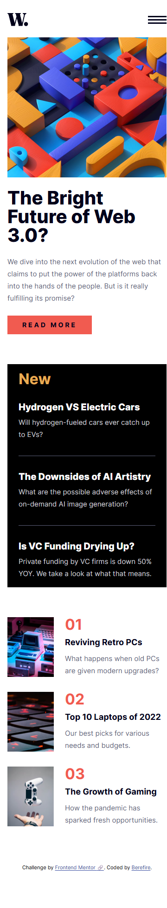 | 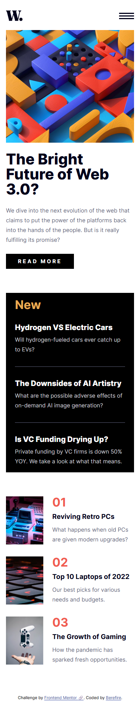 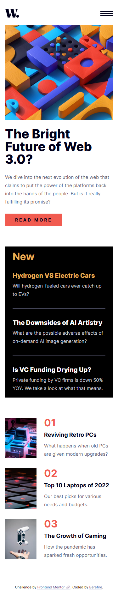  | 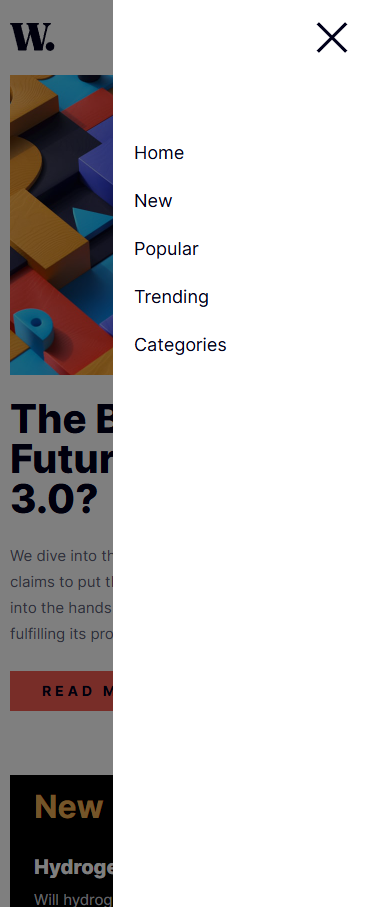 |

#### Tablet (768x914)

| _Default_ | _Active_ | _Menu_ |
| --------- | -------- | ------ |
| 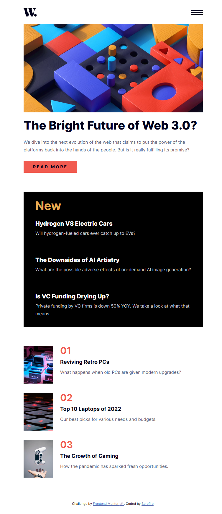 | 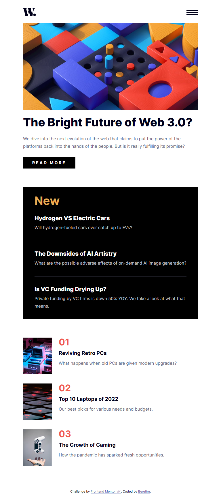 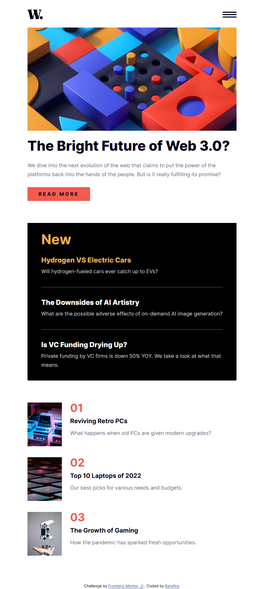  | 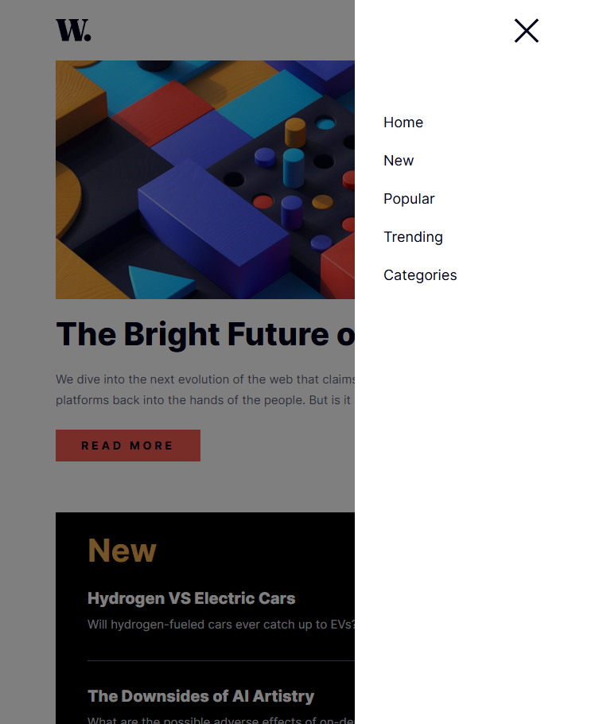 |

#### Desktop (1440x914)

| _Default_ | _Active_ | _Menu_ |
| --------- | -------- | ------ |
| 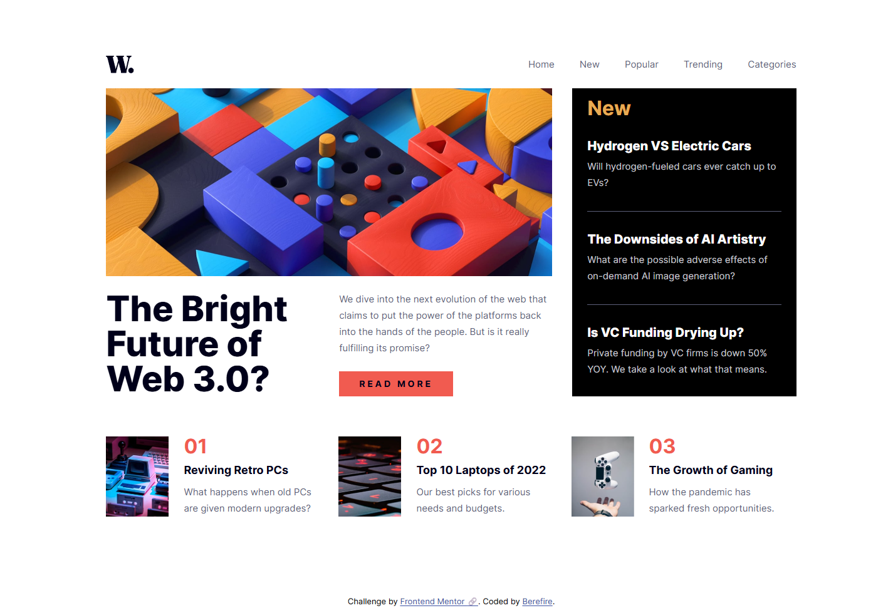 | 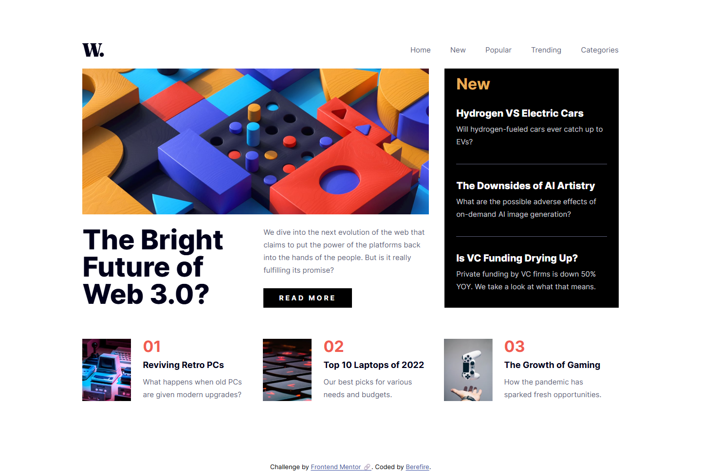 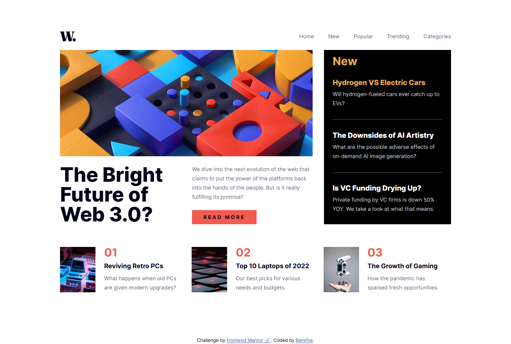  |  |

---

### 🔗Links

- Solution URL: [Add solution URL here](https://your-solution-url.com)
- Live Site URL: [https://berefire.github.io/news-homepage/](https://berefire.github.io/news-homepage/)

## ⚙️My process

### 🛠Built with

- Semantic HTML5 markup
- Modern CSS
- CSS custom properties
- Flexbox
- CSS Grid
- Mobile-first workflow
- CUBE CSS architecture
- Accessible navigation patterns
- JavaScript ES Modules
- HTML `<dialog>` element

---

### ♿Accessibility features

- Semantic HTML structure using landmarks and headings
- Keyboard-accessible mobile navigation
- Focus-visible states for keyboard users
- Accessible dialog menu using the `<dialog>` element
- Proper button semantics for menu controls
- ARIA attributes for menu state management
- Decorative images hidden from assistive technologies when appropriate
- Responsive layout that supports zoom and reflow

---

### 💡What I learned

This project helped reinforce responsive layout techniques using CSS Grid and Flexbox while improving my understanding of accessible navigation patterns.

One of the most valuable learnings was implementing an accessible mobile navigation menu using the native `<dialog>` element combined with JavaScript focus management and keyboard interactions.

I also practiced organizing styles with the CUBE CSS methodology to create reusable and scalable CSS structures.

Example of the mobile navigation logic:

```javascript
  function openMenu() {
    if (menu.open) return;

    menu.showModal();
    requestAnimationFrame(() => {
      menuContent.getBoundingClientRect();
      menu.classList.add("is-open");
    });

    menuButton.setAttribute("aria-expanded", "true");

    document.body.classList.add("u-no-scroll");

    firstLink.focus();
  }

```

---

### 🚀Continued development

In future projects, I would like to continue improving:

- Advanced accessibility patterns
- Focus management in modal interfaces
- Responsive animations and transitions
- Scalable CSS architectures
- JavaScript component organization

---

### 📚Useful resources

- [CUBE CSS](https://cube.fyi/) - Helped me better understand composition-first CSS architecture.
- [MDN - details element](https://developer.mozilla.org/en-US/docs/Web/HTML/Element/details) - Useful for understanding native accordion accessibility behavior.
- [Every Layout](https://every-layout.dev/) - Great resource for modern layout composition techniques.
- [MDN - Logical properties](https://developer.mozilla.org/en-US/docs/Web/CSS/CSS_logical_properties_and_values) - Helped me use modern logical spacing properties effectively.

---

### 🤖AI Collaboration

AI tools were used during this project to:

- Review accessibility patterns
- Improve semantic HTML structure
- Debug responsive layout issues
- Refine dialog and keyboard interactions
- Discuss CSS architecture decisions
- Improve code organization and maintainability

The collaboration was especially helpful for accessibility validation and refining responsive navigation behavior.

---

## 👤Author

- Website - [Add your name here](https://www.your-site.com)
- Frontend Mentor - [@yourusername](https://www.frontendmentor.io/profile/yourusername)
- Twitter - [@yourusername](https://www.twitter.com/yourusername)

---

## 🙏Acknowledgments

Thanks to Frontend Mentor for providing practical challenges that help developers improve real-world frontend skills.

---
